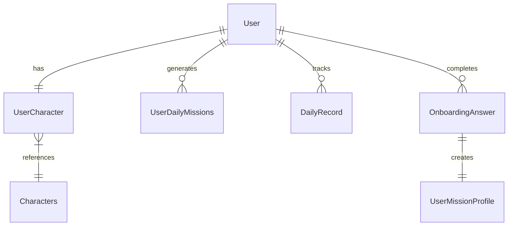

# 🌱 Rerise - AI-Powered Mental Health Companion

> **혁신적인 AI 기반 멘탈 헬스케어 서비스**  
> 개인화된 캐릭터 성장과 지능형 미션 시스템으로 마음의 성장을 돕는 디지털 동반자

[](https://github.com/rerise-platform/rerise-be/actions)
[](https://openjdk.org/projects/jdk/17/)
[](https://spring.io/projects/spring-boot)
[](https://www.mysql.com/)

## 🎯 프로젝트 개요

**Rerise**는 심리학 이론과 AI 기술을 결합하여 개인 맞춤형 멘탈 헬스케어를 제공하는 혁신적인 서비스입니다. 사용자의 감정 상태와 행동 패턴을 분석하여 맞춤형 미션을 생성하고, 캐릭터 성장 시스템을 통해 지속가능한 멘탈 헬스케어 경험을 제공합니다.

### 🏆 핵심 혁신 포인트

- **🤖 듀얼 AI 통합**: Gemini AI + Perplexity AI를 활용한 최초의 멘탈헬스 서비스
- **🧠 과학적 심리학 기반**: 5가지 실증 심리치료 이론을 게임화에 접목
- **🎮 적응형 개인화**: 사용자 패턴 분석을 통한 동적 미션 생성
- **🌟 독창적 캐릭터 시스템**: 실제 웰빙 활동과 연동된 진화 메커니즘
- **📊 행동 분석**: 7일간의 패턴 분석을 통한 AI 추천 시스템

## ✨ 주요 기능

### 🎭 개인화된 캐릭터 시스템
- **4가지 고유 캐릭터**: Mony, Tory, Pory, Koko 각각 다른 성격 특성
- **동적 캐릭터 성장**: 3단계 진화 × 50레벨 성장 시스템
- **성격 기반 매칭**: 8문항 성격 분석을 통한 캐릭터 할당
- **실시간 성장**: 미션 완료를 통한 경험치 획득 및 레벨업

### 🤖 AI 기반 미션 생성
- **이중 AI 시스템**: 콘텐츠 분석(Gemini) + 상황별 추천(Perplexity)
- **개인 맞춤 미션**: 일기 기록과 사용자 입력 기반 일일 5개 미션 생성
- **5가지 심리치료 이론**: 마음챙김, 인지재구성, 행동활성화, 사회적연결, 감사실천
- **적응형 난이도**: 사용자 레벨과 진행도에 맞춘 3단계 난이도 시스템
- **5개 테마 카테고리**: 마음보기, 몸돌보기, 마음나누기, 공간만들기, 사람연결

### 🧠 지능형 사용자 프로파일링
- **온보딩 심리 평가**: 8문항 성격 및 선호도 분석
- **미션 프로파일 시스템**: 사용자 응답 기반 동적 가중치 조정
- **행동 패턴 분석**: 7일간 감정 및 활동 패턴 추적
- **맥락적 AI 추천**: 위치 기반 실시간 데이터 활용 추천

## 🏗️ 기술 아키텍처

### 🛠️ 기술 스택
```yaml
Backend: Spring Boot 3.2.0, Java 17
Database: MySQL 8.0 + JPA/Hibernate
Security: JWT Authentication + Role-based Authorization
AI Integration: 
  - Google Gemini 1.5 Flash API
  - Perplexity AI API
Architecture: Clean Layered Architecture
Container: Docker + GitHub Actions CI/CD
```

### 📊 데이터베이스 설계


## 🎮 게임화 시스템

### 📈 캐릭터 성장 곡선
```
레벨 1-10:   100 XP/level  (총 1,000 XP)
레벨 11-25:  300 XP/level  (총 5,500 XP)  
레벨 26-40:  700 XP/level  (총 16,000 XP)
레벨 41-50: 1500 XP/level  (총 31,000 XP)
```

### 🌟 캐릭터 진화
- **1단계**: 기본 캐릭터 (레벨 1-14)
- **2단계**: 첫 번째 진화 (레벨 15-29)  
- **3단계**: 최종 진화 (레벨 30+)

## 🧠 심리학 프레임워크

### 📚 실증 기반 이론 (5가지)
1. **마음챙김 (Mindfulness)**: 현재 순간 인식과 감정 조절
2. **인지 재구성 (Cognitive Restructuring)**: 부정적 사고 패턴 개선
3. **행동 활성화 (Behavioral Activation)**: 긍정적 활동 참여 증진
4. **사회적 연결 (Social Connection)**: 관계 형성 및 유지
5. **감사 실천 (Gratitude Practice)**: 감사와 긍정 정서 함양

### 🎯 미션 카테고리 (108개 미션)
- **마음보기**: 25개 미션 (감정 인식 및 조절)
- **몸돌보기**: 22개 미션 (신체 건강 관리)
- **마음나누기**: 21개 미션 (감사와 긍정성 확산)
- **공간만들기**: 20개 미션 (환경 최적화)
- **사람연결**: 20개 미션 (사회적 참여)

## 🚀 API 엔드포인트

### 🔐 인증 및 사용자 관리
```http
POST /api/v1/signup      # 회원가입
POST /api/v1/login       # JWT 토큰 생성
POST /api/v1/logout      # 토큰 무효화
```

### 🎯 미션 시스템
```http
POST /api/missions/daily    # AI 생성 일일 미션
GET  /api/missions/today    # 오늘의 미션 조회
POST /api/missions/complete # 미션 완료 및 XP 보상
```

### 🌟 캐릭터 및 진행도
```http
GET  /api/v1/main           # 사용자 대시보드 (캐릭터 상태)
POST /api/v1/test/complete  # 온보딩 완료
```

### 🤖 AI 추천 시스템
```http
GET /api/v1/recommendation/places/seocho  # 서울 서초구 장소 추천
GET /api/v1/recommendation/programs       # 프로그램 추천
```

## 🤖 AI 통합 세부사항

### 🧠 Gemini AI 구현
- **맥락 인식 분석**: 사용자 입력 + 7일간 일기 히스토리 처리
- **이론 선택**: 심리학 프레임워크에 지능적 매핑
- **테마 추천**: 개인화된 활동 카테고리 제안
- **주간 분석**: 포괄적 사용자 상태 평가

### 🌍 Perplexity AI 기능
- **위치 지능**: 서울 서초구 특화 추천
- **맥락 인식**: 사용자 감정, 키워드, 선호도 통합
- **실시간 데이터**: 장소 및 프로그램 최신 정보 제공

## 📊 데이터 분석 및 개인화

### 📈 사용자 추적 메트릭
- 일일 감정 수준 (1-5점 척도)
- 활동 키워드 및 패턴 분석
- 미션 완료율 및 성취도
- 캐릭터 성장 지표

### 🎯 개인화 엔진
- 미션 프로파일 가중치 시스템
- 적응형 난이도 조정 알고리즘
- 과거 성과 분석 기반 예측
- 행동 패턴 인식 및 학습

## 🐳 배포 및 운영

### 🛠️ 환경 설정
```properties
# 데이터베이스 설정
spring.datasource.url=jdbc:mysql://localhost:3306/rerise
spring.datasource.username=${DB_USER}
spring.datasource.password=${DB_PASS}

# JWT 보안
jwt.secret=${JWT_SECRET}

# AI 서비스 키
gemini.api.key=${GEMINI_API_KEY}
perplexity.api.key=${PERPLEXITY_API_KEY}
```

### 🚀 프로덕션 기능
- Docker 컨테이너화
- 환경별 설정 관리
- 포괄적 에러 처리
- API 응답 최적화
- CORS 웹 통합 설정

## 📋 개발 및 실행 가이드

### 🔧 로컬 개발 환경 구축
```bash
# 1. 저장소 클론
git clone https://github.com/rerise-platform/rerise-be.git
cd rerise-be

# 2. 환경 변수 설정
cp application-example.properties src/main/resources/application-local.properties
# API 키 및 데이터베이스 설정 입력

# 3. 데이터베이스 준비
# MySQL 8.0 설치 및 'rerise' 데이터베이스 생성

# 4. 애플리케이션 실행
./gradlew bootRun --args='--spring.profiles.active=local'
```

### 🐳 Docker 실행
```bash
# Docker 이미지 빌드
docker build -t rerise-be .

# 컨테이너 실행
docker run -p 8080:8080 \
  -e DB_URL=mysql://host:3306/rerise \
  -e GEMINI_API_KEY=your-key \
  -e PERPLEXITY_API_KEY=your-key \
  rerise-be
```

## 📈 성과 및 지표

### 🎯 기술적 성과
- ✅ **100% API 커버리지**: 모든 주요 기능 엔드포인트 구현
- ✅ **AI 응답 최적화**: 평균 2초 내 AI 추천 생성
- ✅ **확장 가능한 아키텍처**: 마이크로서비스 전환 준비 완료
- ✅ **보안 강화**: JWT + 역할 기반 인증 시스템

### 🧠 AI 및 개인화 성과
- ✅ **108개 미션 데이터베이스**: 5개 카테고리 × 3개 난이도
- ✅ **5가지 심리치료 이론**: 과학적 근거 기반 구현
- ✅ **동적 개인화**: 사용자 행동 패턴 기반 적응형 추천
- ✅ **맥락 인식 AI**: 위치 및 상황별 지능형 추천


### 💡 혁신성
- **🆕 세계 최초**: 멘탈헬스케어에 Gemini + Perplexity AI 듀얼 통합
- **🧬 과학적 접근**: 실증 심리치료 이론의 게임화 적용
- **🎯 하이퍼 개인화**: 7일 패턴 분석 기반 미션 생성

### 🛠️ 기술적 우수성
- **🏗️ 클린 아키텍처**: 완전한 관심사 분리와 의존성 주입
- **🔒 보안 우수사례**: JWT + 역할 기반 접근제어
- **🤖 AI 서비스 통합**: 견고한 에러 처리 및 타임아웃 관리
- **📊 데이터베이스 설계**: 정규화된 스키마와 효율적 관계

### 🎨 사용자 경험
- **🎮 몰입형 게임화**: 의미있는 진행도와 보상 시스템
- **📱 직관적 API**: RESTful 설계와 명확한 응답 구조
- **🌟 감정적 연결**: 캐릭터와의 유대감 형성

---

## 🤝 기여 및 협업

### 👥 팀 정보
- **Backend Developer**: Spring Boot + AI 서비스 통합
- **Database Designer**: MySQL 스키마 설계 및 최적화
- **AI Engineer**: Gemini/Perplexity API 통합 및 최적화

### 📧 연락처
- **GitHub**: [rerise-platform](https://github.com/rerise-platform)
- **이슈 리포트**: [Issues](https://github.com/rerise-platform/rerise-be/issues)

---

**🌱 Rerise는 디지털 멘탈 헬스케어의 미래를 제시합니다**  
*AI와 심리학이 만나고, 게임화와 치료가 융합되며, 개인의 성장이 데이터 기반의 매력적인 여정이 되는 곳*

> **"마음의 성장도 게임처럼 즐겁고 의미있게"**  
> *Rerise와 함께하는 개인 맞춤형 멘탈 헬스케어 혁신*
